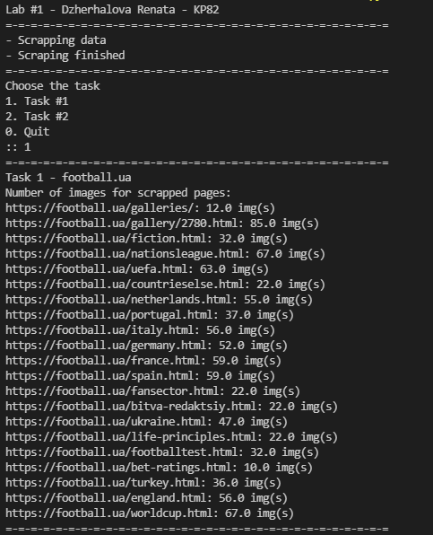
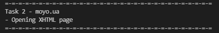
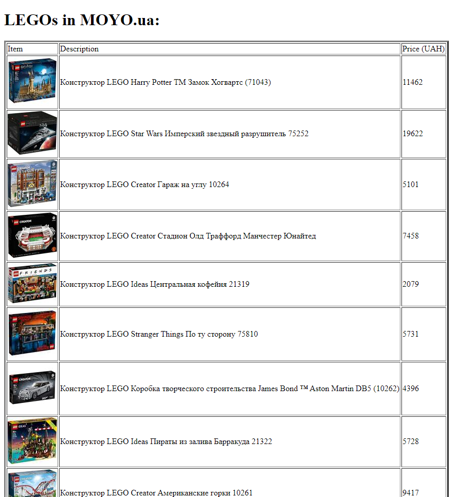

# Lab 1
## Вивчення базових операцій обробки XML-документів 
## Dzherhalova Renata, KP-82, №5

### Task 1

Підрахунок кількості графічних фрагментів по кожному документу на сайті `football.ua`.

### Task 2

Отримання ціни, опису та зображення для 20 товарів з інтернет-магазину `moyo.ua`, додавання результату до xhtml-таблиці.

