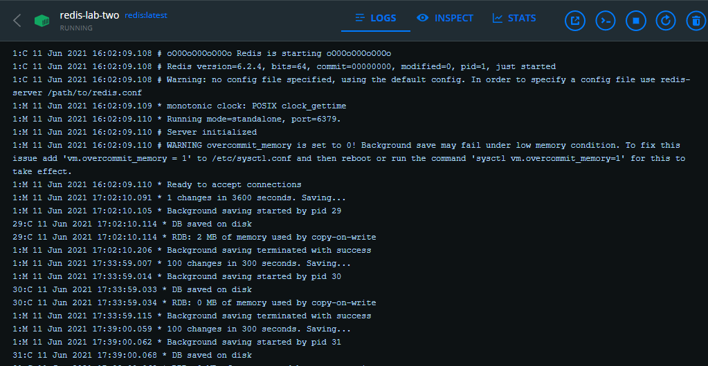
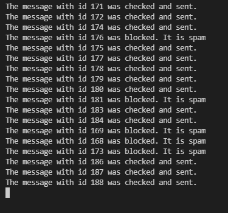
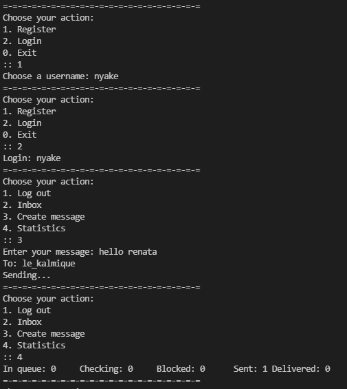
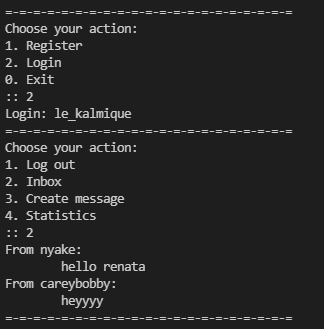
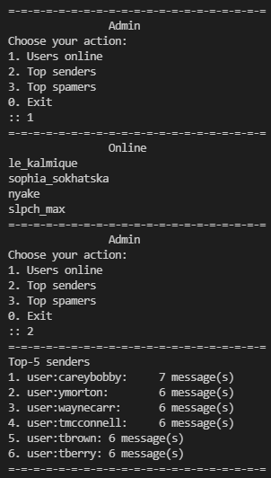
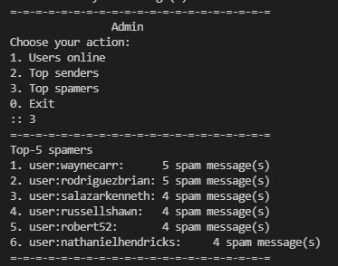

# Lab 2
## Практика використання сервера Redis 
## Джергалова Рената, КП-82

### Завдання
Реалізувати можливості обміну повідомленнями між користувачами у оффлайн та онлайн режимах із можливістю фільтрації спам-повідомлень.

### Обрані структури даних
*Зберігання повідомлень*: хештаблиця (`Hash`).  
Ця структура даних надає можливість зберігати пари ключ-значення. У випадку зберігання повідомлень ключ - це ідентифікатор повідомлення, а значення - об'єкт з відправника, отримувача та самого повідомлення.

*Зберігання користувачів*: множина (`Set`).  
Ця структура даних обрана, бо нам не важливий порядок користувачів, але важлива швидкість доступу.

*Черга повідомлень*: список (`List`).  
У цій структурі даних час додавання та вилучення записів є константним, крім цього зберігається порядок записів. Це є важливим у разі черги повідомлень.

### Робота програми

Сервер redis був запущений за допомогою Docker.  
Версія: `6.2.4`

Запущено `worker.py`, 4 користувачі `user.py`, 1 адміністратор `admin.py`. Для додаткової перевірки запущений емулятор `emulation.py`.

  
Працюючий обробник черги повідомлень  
  
  
Реєстрація, логін, створення повідомлення та статистика користувача
  
  
Вхідні повідомлення користувача
  

  
Перевірка користувачів онлайн, топ-5 відправників, топ-5 спамерів
  
