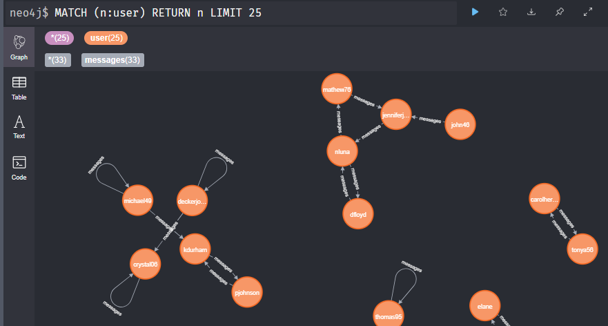
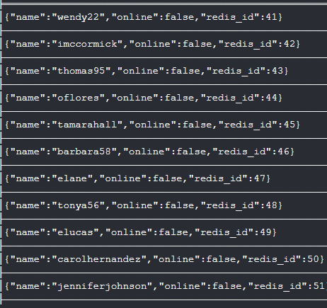
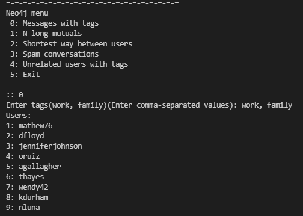
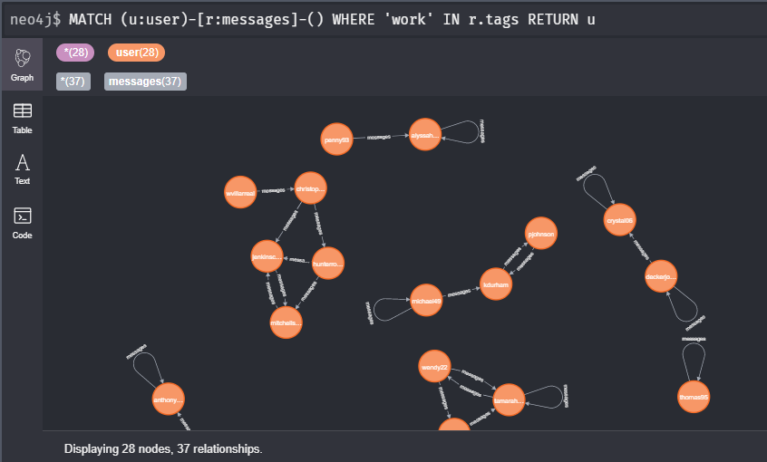
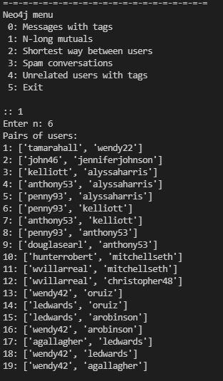
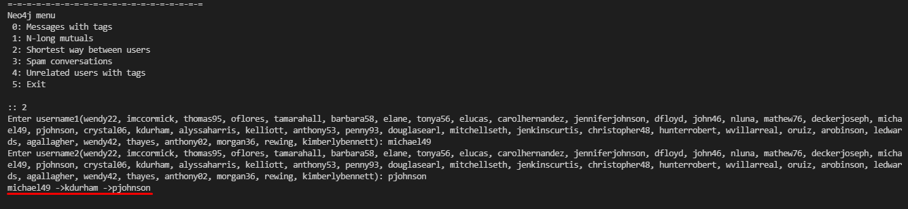
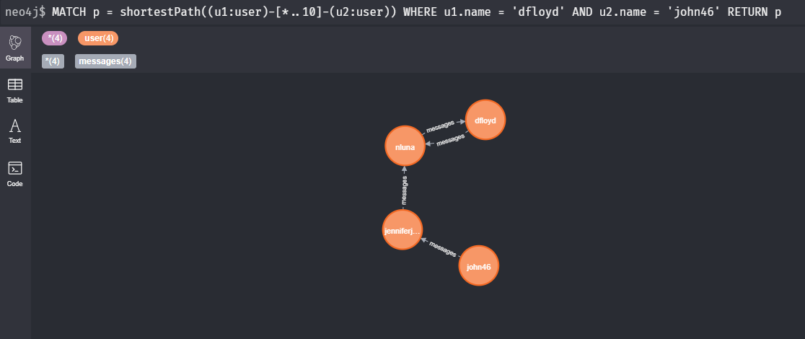
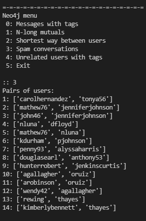
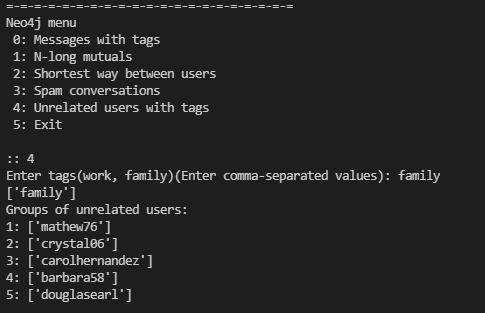

# Lab 3
## Практика використання графової бази даних Neo4J
## Джергалова Рената, КП-82

Приклад вигляду даних у neo4j browser (`localhost:7474`):

  

**Приклади роботи:**

1. Користувачі, що відправляли/отримували повідомлення з набором тегів  
     
    
   

 

2. Пари користувачів, що мають зв'язок довжиною N  
   

 

3. Найкоротший шлях між двома користувачами  
   
    
   

 

4. Автори повідомлень, що пов'язані лише спамом  
   

 

5. Користувачі, що відправляли/отримували повідомлення з тегами, не пов'язані між собою  
   